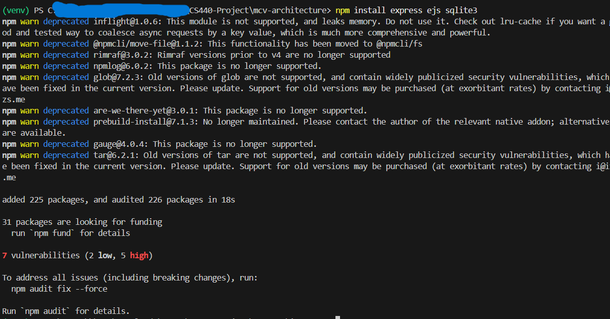
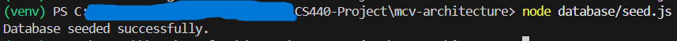
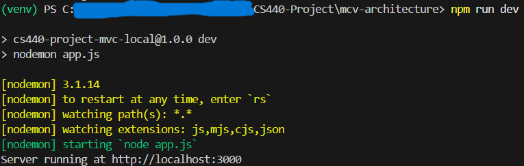

# CS440 Movie Database - MVC Version

This project is a refactored version of the original CS440 movie database system using the Model-View-Controller (MVC) architectural style.

This version of the application runs locally using:

* Node.js
* Express
* SQLite
* EJS templates

No external services or cloud databases are required. The reason behind these choices was simple to familiarize myself with them. I (Haley Berger) really have not used much Node.js, but I know it is popular and so I wanted to give it a try.

---

# Requirements

You must have these installed for this to work:

* Node.js (v18 or newer)
* npm

You can check with:

```bash
node -v
npm -v
```

---

# Setup Instructions

Clone the repository:

```bash
git clone https://github.com/heb229/CS440-Project.git
```

Navigate into the project folder:

```bash
cd CS440-Project/mvc-architecture
```

Install the required dependencies:

```bash
npm install
```

---

# Initialize the Database

This project uses a local SQLite database. Run the seed script to create the database and populate it with sample data:

```bash
node database/seed.js
```

This script will:

* create the database file
* create all required tables
* insert example movies, people, and critiques

In other words, it does all inital setup for you. This should make testing super quick and smooth.

---

# Run the Application

Start the server (reminder, this is local):

```bash
node app.js
```

Or if using nodemon:

```bash
npm run dev
```

I recommend using the nodemon version. It doesn't really matter, but I just find the command to be more consistent when using it (as in, other commands also use nmp run, so it is easier to remember).

---

# Open the Website

Once the server starts, open a browser and go to your local host (we are using port 3000 for this, but you can feel free to change this in the code):

```
http://localhost:3000
```

---

# Example Pages

Home page:

```
http://localhost:3000
```

Movie details:

```
http://localhost:3000/movie/1
```

Person details:

```
http://localhost:3000/people/2
```

Critiques page:

```
http://localhost:3000/critiques
```

---

# Project Structure

```
mvc-local/
- app.js
-package.json

- controllers/
- models/
- routes/
- views/
|  - EJS templates

- public/
|  - CSS and JavaScript

- database/
|  - schema.sql
|  - seed.js
```

---

# Resetting the Database

If you want to recreate the database with the original sample data, run:

```bash
node database/seed.js
```

This will reset the tables and reinsert the starting/inital records.

---

# Extra Example Images

## Running Locally

When running the install, this is sort of what it may look like. PLEASE DO NOT BE CONERNED. This is normal. You may also notice that I did the install a bit differently than just `npm install` like I instructed above. You do not need to do it like seen in the screenshot. All the dependiencies are in the package.json file, which gets run automatically. I just did it manually here so that you can see what dependencies are installed.



Next up is seeding and starting the database. This is what your terminal should look like after running the command.



Then, this image below shows what your terminal should look like after starting up the actual server.

